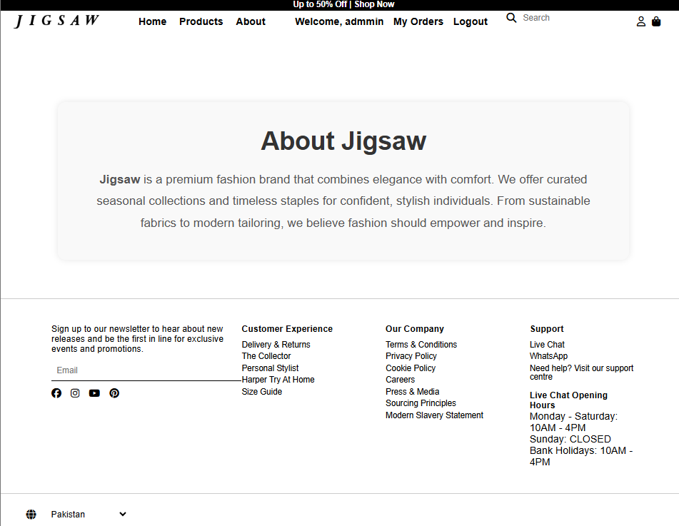
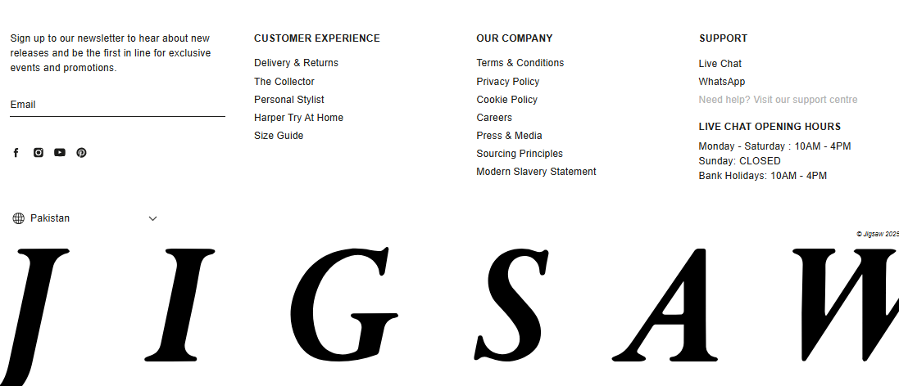
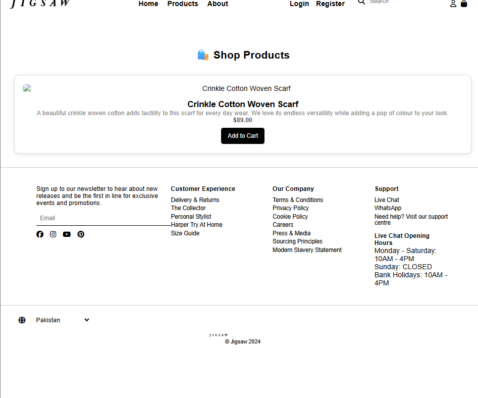
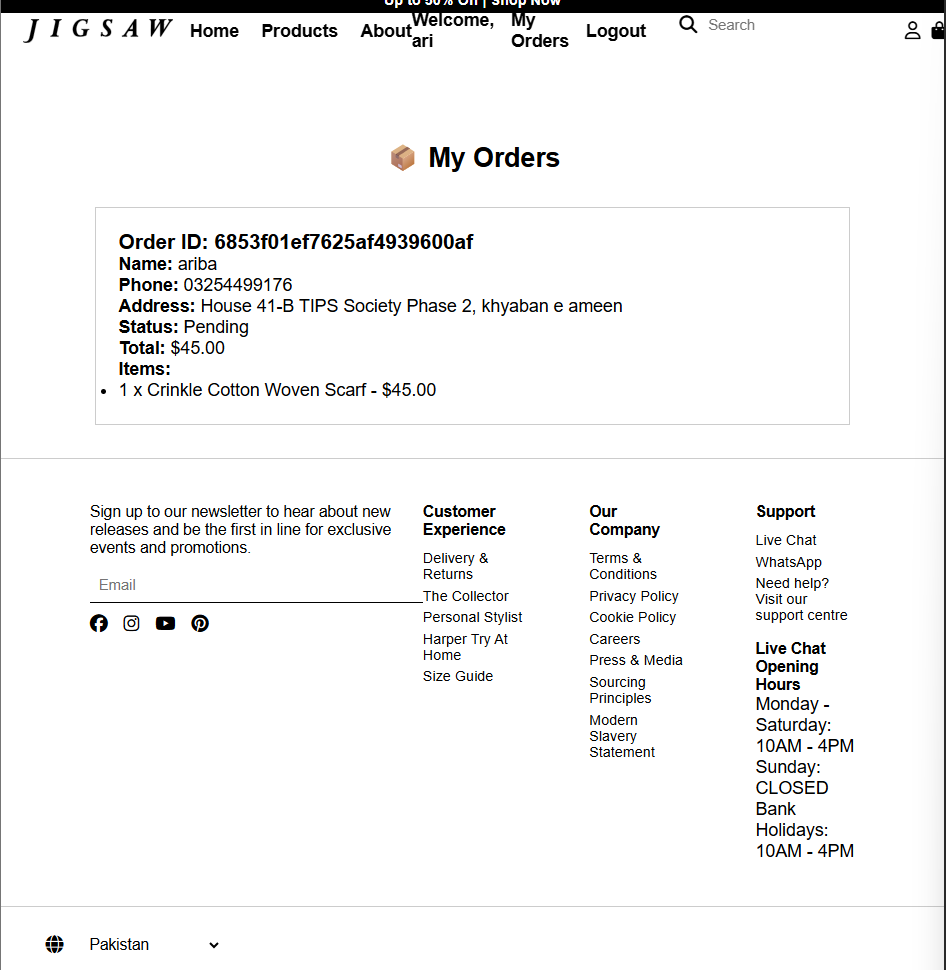
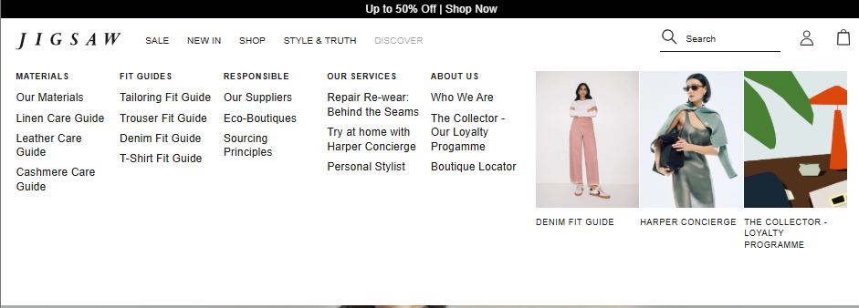

# 🛍️ Jigsaw Online

A modern **eCommerce web application** built with **Express.js, EJS, and MongoDB**.  
It includes a complete shopping experience for **users** and an **admin dashboard** for managing products and orders.

---

## 🚀 Features

### 👤 User Panel
- Browse products with details
- Add to cart from listing or product detail pages
- Update cart quantities or remove items
- Checkout with name, phone number, and address
- Place orders with “Pay Later (Cash on Delivery)”
- View past orders in **My Orders**

### 🛠️ Admin Panel
- Dashboard to view all orders
- Manage products (add, edit, delete)
- Track customer details and order history
- Update order status (Pending → Shipped → Delivered)
- Manage inventory efficiently

---

## 📸 Screenshots

### 🌐 Landing & General Pages
- **Landing Page**  
  

- **About Page**  
  

- **Footer Section**  
  

---

### 👤 User Panel

    
- **Product Page**  
  

- **Add to Cart**  
  

- **My Orders**  
  

- **Dropdown Menu**  
  

---

- **Admin Dashboard & Order Management**  

    
    
    
    
  
