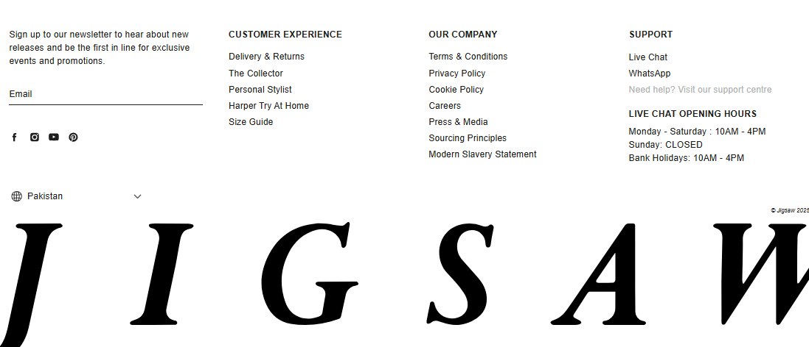
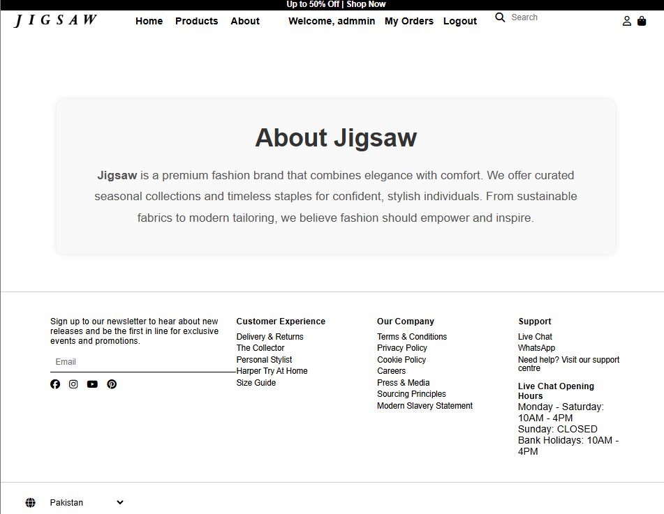
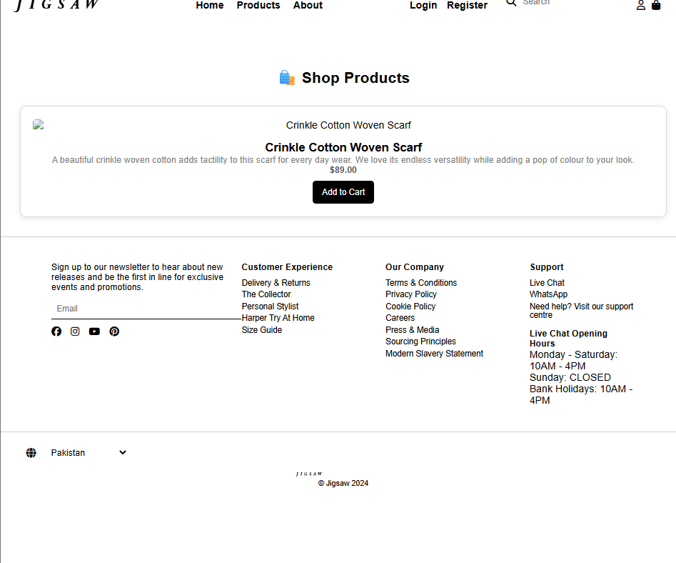
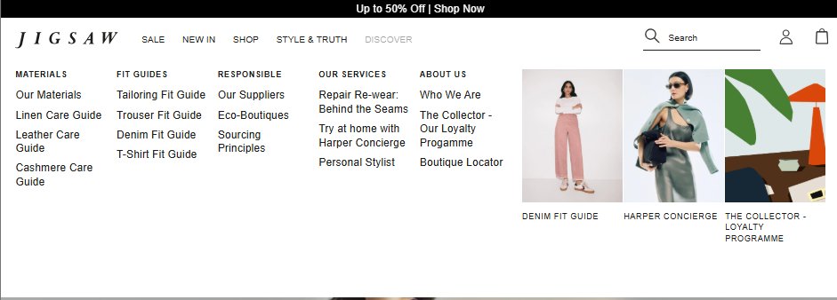
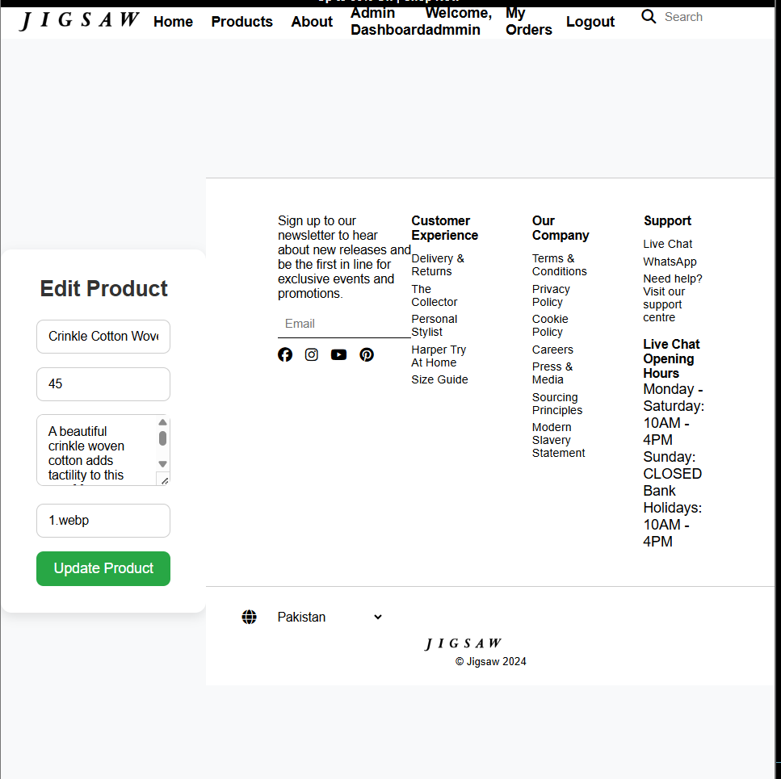
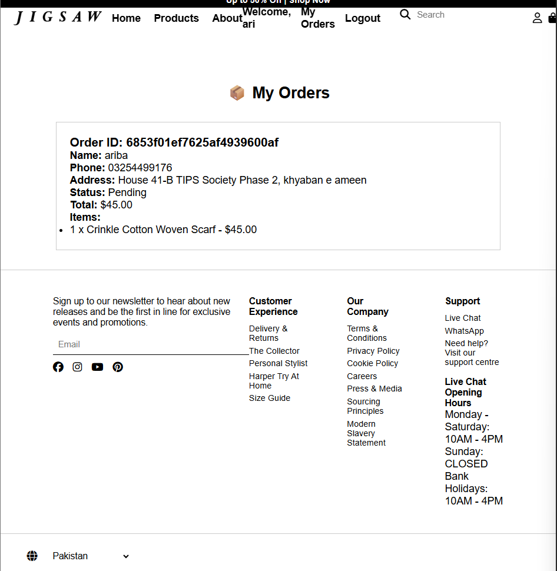

# Jigsaw E-Commerce Web Application

This project is a full-stack e-commerce platform built using Node.js, Express.js, EJS, and MongoDB. The application includes both user and admin interfaces, supporting product management, cart functionality, user authentication, and order tracking.

## Overview

The goal of this project was to build a functional online shopping platform from the ground up using JavaScript on both the client and server side. It features real-time cart updates, secure authentication, and dynamic rendering with EJS templates.

## Features

### User Functionality
- Browse and view product listings with responsive UI
- Add items to cart from product or detail pages
- View, update, and remove items from cart
- Checkout with form validation (name, email, card, etc.)
- Place orders with "Pay Later with Cash" option
- View order confirmation page after checkout
- Register and log in to manage sessions securely

### Admin Functionality
- Admin authentication and protected routes
- Add new products with image, price, and description
- Edit or delete existing products
- View all orders placed by users, including status and details

### JavaScript Functionality
- Cart logic implemented using client-side JavaScript and session storage
- Form validation using custom JavaScript (email, card info, phone, etc.)
- JavaScript-enhanced UI interactions (quantity updates, error messages)
- Express.js routes and controllers written in JavaScript
- EJS templates dynamically rendered with data passed via Express routes

## Tech Stack

- **Frontend:** HTML, CSS, Bootstrap, JavaScript, EJS
- **Backend:** Node.js, Express.js
- **Database:** MongoDB with Mongoose
- **Authentication:** express-session, custom middleware
- **Validation:** HTML5 attributes + JavaScript validation scripts

## Folder Structure

project-root/
├── public/ # Static assets (CSS, JS, images)
├── views/ # EJS templates (pages, layouts, partials)
├── routes/ # Express route handlers
├── controllers/ # Logic for routes
├── models/ # MongoDB schemas (Products, Users, Orders)
├── config/ # DB config and middleware
├── app.js # Main Express application
└── package.json

## Screenshots

### Landing Page  
  
  

### Product Listing  

### Add to Cart  

### Dropdown Menu  

### Admin - Edit Product  

### Admin - Orders View  

